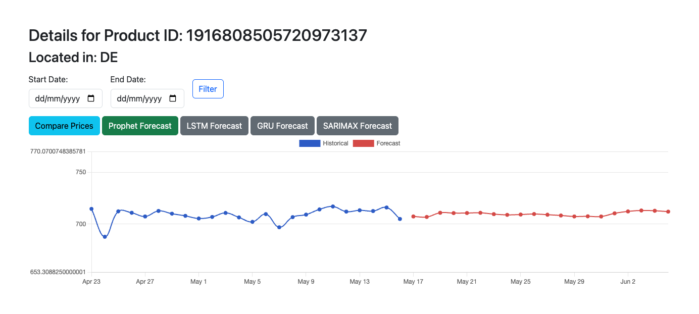
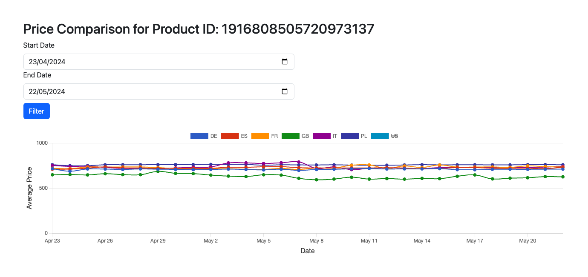

# Price Comparison and Prediction System

## Requirements

- Ruby >= 3.0
- Rails >= 7.0

## Getting Started

Follow these steps to set up and run the project on your local machine.

### Prerequisites

Ensure you have the required versions of Ruby and Rails installed.

### Installation

1. **Clone the repository:**

    ```sh
    git clone git@github.com:SebastjanPrachovskij/price_comparison.git
    cd git@github.com:SebastjanPrachovskij/price_comparison.git
    ```

2. **Install the necessary gems:**

    ```sh
    bundle install
    ```

3. **Run database migrations:**

    ```sh
    bin/rails db:migrate
    ```

4. **Install JavaScript dependencies:**

    ```sh
    yarn install
    ```

### Running the Project

To start the project, use the following command:

```sh
bin/dev
```

## Running SARIMAX, LSTM and GRU models

To use SARIMAX, LSTM, or GRU prediction models, head to the [prediction models micro-server](https://github.com/SebastjanPrachovskij/prediction-models), install dependencies, and run the server.

## Use case

Currently, we are predicting Google Shopping product prices. Here are some examples of images from the UI:



## Price comparison between countries


